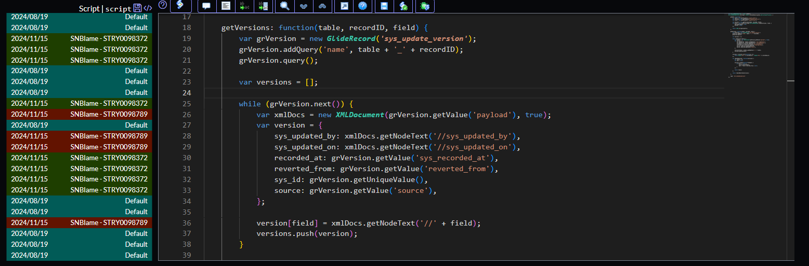

SNBlame is an extension for ServiceNow.
The extention annotates on each line the update set, date and user that did the modification.

SNBlame does NOT show per line modifications in a chronological sense, it displays who did the last modificaiton on a given line

Extension options:
**Start on click**
boolean: do not load SNBlame until 'LOAD BLAME' button is used 
**Show update set/user**
boolean: switch between showing update set name or user name in the gutter 
**Hide gutter date**
boolean: show/hide date in the gutter 
**Gutter Width**
slider: increase/reduce SNBlame gutter size

